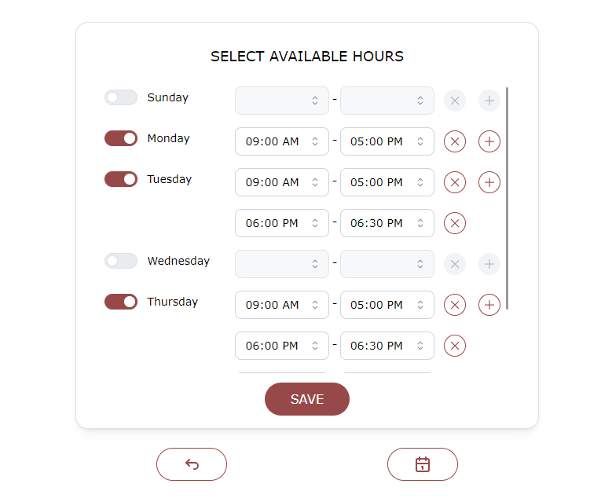
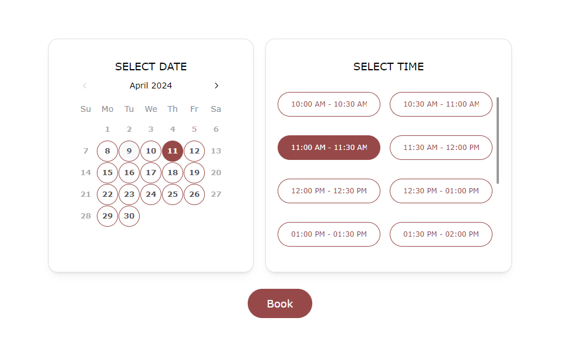

# Meeting Schedule App - SimpliMeet

This Meeting Schedule App allows users to manage and schedule meetings efficiently. It is built using `Remix`, `Prisma`, `Mantine`, and `Dayjs`.


## Key Features

`Set available times based on weekdays`: 
Users have the option to specify available time slots based on weekdays, thereby optimizing organizational efficiency and boosting productivity.

`Schedule new meetings`: Users can conveniently schedule new meetings by specifying the date, time on the Calendar.


`View upcoming meetings`: Users can easily see the details of their upcoming meetings, including dates, times, username and email.

## Tech Stack

- **Remix**: A modern web framework for building fast, resilient, and scalable client-server applications.
- **Prisma**: A powerful database toolkit for data access, migrations, and data modeling in Node.js and TypeScript.
- **Mantine**: A react components library with focus on usability, accessibility and developer experience.
- **Dayjs**: A minimalist JavaScript library that parses, validates, manipulates, and displays dates and times.

## Clone the Repository

```bash
  git clone https://github.com/sheriffwoody0922/simpliMeet.git

  cd simpliMeet
```
## Development

Setup your environment:

Copy the `.env.example` file to `.env`:

```shellscript
cp .env.example .env
```

Install dependencies:

```shellscript
npm install
```

Run the Vite dev server:

```shellscript
npm run dev
```

### Prisma

This template includes Prisma for database access.
When updating your `prisma/schema.prisma`, you'll need to run:

```shellscript
npm run generate
```

To view the Prisma Studio, run:

```shellscript
npx prisma studio
```

## Deployment

First, build your app for production:

```sh
npm run build
```

Then run the app in production mode:

```sh
npm start
```